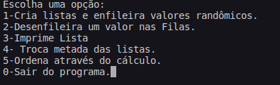

# Problema-3

 
 

Uma estrutura baseada em fila tem por definição a regra de sempre remover do início e inserir novos elementos no final. Sabendo-se disso, 
vamos praticar a utilização desse conceito nos seguintes problemas: 

    
a: Escreva uma função que receba pares de filas, ambas de tanho n, divida ambas ao meio
    e ligue as metadas para compor duas novas filas, as quais devem ser retornadas para o usuário. Tais filas devem ser definidas como dinâmicas. 

    
b: Escreva uma função que aplica uma equação matemática qualquer aos numeros de uma fila. Essa equação tem por objetivo produzir
    um indexador para a fila dada como entrada, logo, precisa ser retornado junto com a fila para o usuário. 

    
c: Elabore uma função que receba um conjunto de filas, todas com valores de indexação conforme item (b). Ordene esse grupo de  
    filas pelo método da bolha e as retorne ao usuário considerando o maior valor de indexação como cabeça dessa ordem. 

    
# Solução

 Criou-se 4 funções além das principais. 

A função Crialista() tem como parâmetro duas listas e um inteiro n que define os tamanho das
mesmas. Nessa função existe um for que chama a função Enfileira() com números randômicos. Após escolher essa função pela segunda vez, a lista gerada é
automaticamente inserida na lista anterior. 

    void Crialista(Fila *f, Fila *l, int n){
      Item aux;
      int i;
      for (i = 0; i < n; i++){
        aux.val = rand() % 100;
        Enfileira(f, aux);
      }

      for (i = 0; i < n; i++){
        aux.val = rand() % 100;
        Enfileira(l, aux);
      }

    }
    

Além disso, a funçao TrocaFila divide as Filas em dois, atribuindo as divisões em filas auxiliares e inverte o final entre elas, como 
definido no problema 3 - a. Para isso foramcriados for para cada lista que conta do início até o meio da lista e do meio até o final. Cada For 
desenfileirando e enfileirando nas filas definidas.

    void TrocaFila(Fila *f, Fila *l, int n){
      Fila x, z;
      Item aux;
      int i;

      FFVazia(&x);
      FFVazia(&z);

      printf("%d", n);

      //Pega a primeira parte das filas e enfileira nas filas auxiliares
      for(i = 0; i < (n/2); i++ ){
        Desenfileira(f, &aux);
        Enfileira(&x, aux);
      }

      for(i = 0; i < (n/2); i++ ){
        Desenfileira(l, &aux);
        Enfileira(&z, aux);
      }

      //Desenfileira a segunda parte das listas e coloca nas listas auxiliares invertidas

      for(i = n/2; i < n; i++ ){
        Desenfileira(f, &aux);
        Enfileira(&z, aux);
      }

      for(i = n/2; i < n; i++ ){
        Desenfileira(l, &aux);
        Enfileira(&x, aux);
      }
      //Atribui as filas auxiliares nas filas iniciais
      *f = x;
      *l = z;

    }
    

 Na função Calcula(), com o valor gerado na pelos números randômicos, realiza-se um cálculo básico que retorna ao usuário ao escolher
imprimir a lista com a função FImprime(), como pedido no Problema 3 - b. 
  
      void Calcula( Item *d){
        d->calculo = sqrt((d->val * 2)+ d->val/(0.5*d->val));
      }

 
 A última função acrescentada OrdenaBubble(), utiliza-se o método da bolha para ordenar as listas através do calculo definido no
 Problema 3 - b. A função realiza um swap sempre que encontra um valor menor após um valor maior na lista. 
   
     void OrdenaBubble(Fila *f){
      bool mudou = false;
      Block *aux1, *aux2 = NULL;

      Item tmp;

      do{
        mudou = false;
        aux1 = f->first;
        while(aux1->prox != aux2){
          if(aux1->data.calculo > aux1->prox->data.calculo){
            tmp = aux1->data;
            aux1->data = aux1->prox->data;
            aux1->prox->data = tmp;
            mudou = true;
          }

          aux1 = aux1->prox;
        }

        aux2 = aux1;
      }while(mudou);
    }
  
   
<h4> main.h </h4>
  
 
No main foi inicializado as listas vazias, e criou-se um Switch() para o usuário escolher sua opção conforme deseja. Em cada caso, foi
  chamado as funções específicas e retornando ao usuário sua escolha.
  
    int main(){
      Fila f, l;
      Item aux;
      int menu, n, count =0;

      FFVazia(&f);
      FFVazia(&l);
      printf("Escolha uma opção:\n1-Cria listas e enfileira valores randômicos.\n2-Desenfileira um valor nas Filas.\n3-Imprime Lista\n4- Troca metada das listas.\n5-Ordena através do cálculo.\n0-Sair do programa.");
      scanf("%d", &menu);
      printf("\nDigite o tamanho das listas: ");
      scanf("%d", &n);

      while(menu != 0){
        switch(menu){
          case 1: 
            Crialista(&f, &l, n);
            count++;
            break;

          case 2: 
            Desenfileira(&f, &aux);
            Desenfileira(&l, &aux);
            break;

          case 3: 
            FImprime(&f);
            FImprime(&l);
            break;

          case 4:
            n = n * count;
            TrocaFila(&f, &l, n);
            break;
          case 5: 
            OrdenaBubble(&f);
            break;

          default: printf("Valor inválido,");
        }
        printf("Escolha uma opção:\n1-Cria listas e enfileira valores randômicos.\n2-Desenfileira um valor nas Filas.\n3-Imprime Listas\n4- Troca metada das listas.\n5-Ordena através do cálculo.\n0-Sair do programa.");
        scanf("%d", &menu);
      }

      return 0;
    }
  

 Veja um exemplo das opçãoes: 

  

# Compilação e Execução

O algoritmo disponibilizado possui um arquivo Makefile que realiza todo o procedimento de compilação e execução. Para tanto, temos as seguintes diretrizes 
de execução:

| Comando                |  Função                                                                                           |                     
| -----------------------| ------------------------------------------------------------------------------------------------- |
|  `make clean`          | Apaga a última compilação realizada contida na pasta build                                        |
|  `make`                | Executa a compilação do programa utilizando o gcc, e o resultado vai para a pasta build           |
|  `make run`            | Executa o programa da pasta build após a realização da compilação                                 |
